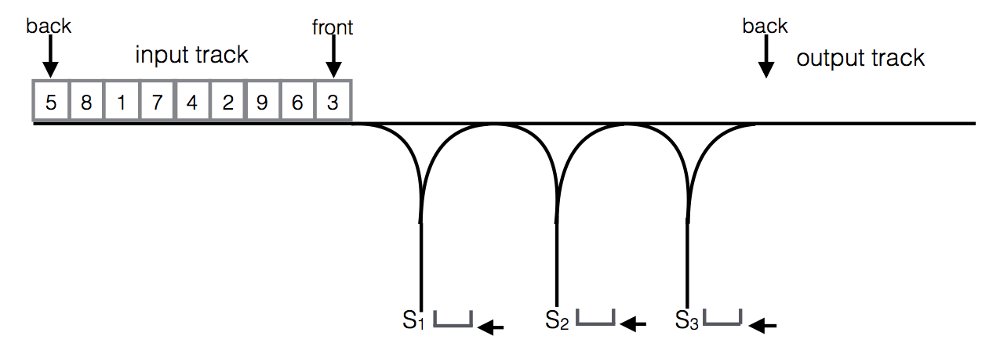
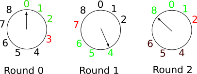

# Homework 2
COMS W3134 - Data Structures in Java
* 100pts toal
* Due: Wednesday 10/07 11:59pm


Please be aware of the [late homework and academic honesty policy on the course website](http://www.cs.columbia.edu/~bauer/cs3134/homework.html).

## Part 1 - Theory (48 pts)
Answer the questions for Part 1 in a separate `.txt` file or `.pdf` file. Only plain text and PDF documents will be graded. Please make sure the size of your PDF documents doesn't exceed 500kB.


### Problem 1: Comparing Growth Rates (16 pts)

Arrange the following functions by growth rate (slowest growth to fastest growth). Indicate which functions grow at the same rate (i.e. *f(N) = Θ(g(N))*)

*23N*, *42N³*, *2ⁿ*, *√N*, *3ⁿ*, *N²*,*log N*, *2/N*, *128*, *N log N*, *2ⁿ⁺¹*, *N!*


### Problem 2: Running Time Analysis (16 pts)

Give an analysis of the Big-O running time for each of the following program fragments. 
Clarification: Specifying O(2^N) as an upper bound for the running time would be trivially true for all these examples, but not very informative. We are generally looking for as tight a bound as possible, i.e. big-Theta. 

```
int sum = 0;
for (int i = 0; i < n; i++)
    for(int k=i; k < n; k++)
        sum++;
```

```
int sum = 0;
for (int i = 0; i < 23; i++)
    for (int j = 0; j < n; j++)
        sum++;
```

```
public int foo(int x,int k) {
    if (x <= k)
        return 1;
    else
        return foo(x / k, k) + 1;
}
```

### Problem 3: Re-arranging Train Cars (16 pts)

In the MTA Subway system, occasionally cars on a train need to be re-arranged. For instance, assume we label the cars of a train with the number `[5,8,1,7,4,2,9,6,3]` (right end of the list is the front of the train), and we would like to arrange the cars like this: `[9,8,7,6,5,4,3,2,1]`.

For this purpose the MTA has special *shunting* yards. A shunting yard consists of an *input track*, an *output track*, and *k* holding tracks (in this problem *k=3* and the holding tracks are *S₁, S₂, S₃*. The input and output track operate like queues (in FIFO fashion). The holding tracks have to be used like stacks (in a LIFO fashion): The last train car entering the holding track is the first car to leave the track.



To reorganize a train, the train dispatcher can use only the following operations:

* Move the car at the front of the input track to the back of of the output track.
* Move the car at the front of the input track to the top of one of the holding tracks.
* Move the car at the top of one of the holding tracks to the back of the output track.

Cars cannot be moved between the holding tracks. Once a car is on a holding track it cannot move back to the input track (since the input track is a queue). The goal is always to organize the train cars in increasing order (front to back on the output track, as in the example).

Answer the following questions:

* **(a) (8 pts)** Provide a solution for this specific input train and 3 holding tracks as a sequence of steps.

* **(b) (8 pts)** Is there a solution for any train of length 9 with 3 holding tracks? Explain why or why not.

## Part 2 - Programming (52pts)

### Problem 4: Text Editor Buffer (26 pts)

You are part of a group building a text editor for large files, up to
10 million of Java 'char' primitives.  Your job is to implement the
Buffer interface that the group has specified. The buffer holds the
text being edited.  The `Buffer.java` interface in the file
`2/src/Buffer.java`. Your implementation should be in a class called
`FastBuffer.java`. In other words, `FastBuffer.java` implements `Buffer.java`.

You need not worry about dynamically sizing `Buffer.java`. Just build
it so it will handle a max of 10 million chars.

The editor is intended for relatively slow computers, like an Arduino,
or Raspberry PI, so your group really wants `insertLeft`,
`deleteRight`, `deleteLeft`, `moveRight`, and `moveLeft` to be O(1),
so the editor will feel fast and responsive to the user.

The head of the editor group, who you are trying to impress, is a big
fan of stacks. Implementing the buffer with any other data structure
would be a bad career move on your part. She is a real stickler about
only using ADT stack methods like `push()`, `pop()`, `peek()` and
`size()`. 

The boss has given you two options to complete the task:

1 - For your stacks, use a memory efficient class that implements
java.util.Deque. Use addFirst() for push, removeFirst() for
pop, and peekFirst() for peek.

2 - Implement the stacks yourself, such that all your stacks use a
single char array for storing the data. (You get 10 bonus pts for 
this approach.)


### Problem 5: Eeny, meeny, miny, moe (26pts)

**(a) (11 pts)**
"Counting-Out" is a simple game. *n* players stand in a circle. In each round one of the players is "counted out". The game master begins at some point in the circle and then proceeds around the circle in clockwise direction. He skips the first *k-1* players and the *k*-th player has to leave the circle. He then skips the next *k-1* players etc. In each round the circle becomes smaller, until a single person remains and is the winner.

In the class `CountOut` implement a simulator for this game. Complete the static method `play` that runs a simulation for a given *n* and a given *k* and uses a single Queue to simulate the circle of players. The method should return a list containing player numbers in the order in which they are counted out.

For instance, for *n=9* and *k=4* the first three rounds of the game look like this:



In round 0, counting starts at player 0. Player 0, 1, and 2 are skipped, player 3 is counted out. In round 1, counting starts at player 4. Player 4, 5, and 6 are skipped and player 7 is counted out, etc.

`play(9,4)` should return the list `[3, 7, 2, 8, 5, 4, 6, 1, 0]`, which is the complete sequence in which the players are counted out. 0 wins.

Also implement the method `findWinner` that returns the last remaining player. What is the running time of this method (provide a tight big-O bound in terms of *k* and *n*)?

**(b) (15pts)**
There is a simple (but somewhat tricky) recursive algorithm that finds the winner and does not require a Queue (or any data structure to hold a representation of the circle of players). The basic insight for this algorithm is that, if you know who the winner of a game with the same *k* but *n-1* players is, it is easy to figure out who will win the game with *n* players. For *n=1*, player 0, the only player, is always the winner.

Implement this algorithm in the recursive method `findWinnerRec`.
Hint: Use the modulo operator `%` to determine the player who is counted out in each round.
What is the running time for this algorithm (provide a tight big-O bound)?
