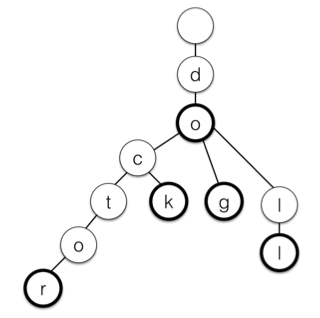

# Homework 3
COMS W3134 - Data Structures in Java
* 100pts toal
* Due: Friday 10/23,  11:59pm

Please be aware of the [late homework and academic honesty policy on the course website](http://www.cs.columbia.edu/~bauer/cs3134/homework.html).

Make sure to check that you submitted all your files to Github. In general, late submissions will not be accepted.

#Part 1 - Theory (23 pts)

## Problem 1 (11 pts)
**(a)** Assume  you  start  with  an  empty Binary Search Tree. Show  the  result  of  inserting  3,7,2,8,9,4,5 into the tree (in this sequence). Is the tree balanced? If not, where is the balance condition violated?

**(b)** Show the result of deleting the root of the tree from part (a) (using the convention for the deletion operation made in class).

## Problem 2 (12 pts)
Show the result of inserting 3,7,2,8,9,4,5 (in this sequence) into an initially empty AVL tree.  You do not need to draw all intermediate trees, but please pecify which rotations are needed (if any) and around which node.

#Part 2 - Programming (77 pts)

## Problem 3: Binary Search Trees   (33 pts)
In this problem, you will add functionality to a Binary Search Tree implementation in `3/src/BinarySearchTree.java`. Note that we changed the implementation discussed in class by integrating the basic Tree data structure into the BinarySearchTree class so that only one class is needed.

### a) (11 pts)
Write a method `public boolean isBst()` that returns true if the tree is a Binary Search Tree. You may want to use the public method / private method pattern, where a non-recursive public method calls a private recursive method. An example can be found here [Recitation Week 5 Friday Tree Sample Code](https://github.com/cs3134/recitations/blob/master/week5-fri/basic-tree/src/Tree.java)

### b) (11 pts)
Write a method `public List<T> getInterval(T min, T max)` that returns all elements *x* from the Binary Search Tree, such that *min <= x <= max*. Your method should run in *O(k + log N)* where *k* is the number of elements in the resulting list.

### c) (11 pts)
Make the BinarySearchTree iterable by implementing the `java.util.Iterable` interface. Write an appropriate Iterator class. The iterator should return the values in the tree in post order. 

## Problem 4: Trie (44 pts)

A **trie** (aka a prefix tree)  is a compact representation of a set of words in a tree. Every node in the tree corresponds to the prefix of a word. The children of a node represent all different strings that share the same prefix but differ in the last letter. The root node represents the empty prefix.

The following prefix tree represents the words `[do, dog, doll, dock, doctor ]`. Note that some nodes (displayed in bold) are specially marked as end-of-word nodes. You can read off a word by starting at the root and following a path down until you reach a bold node.

You're given the class `Trie.java` with a inner class `TrieNode.java` that represents the skeleton code of a trie and its node. In the code, the root node has the letter `'0'` (shown in the line `public static final char NULL = '0';`). Note that in a trie, a node can have up to 26 (one for each letter a-z of the alphabet). The children are therefore stored in an array.  
Also note that each node contains an end-of-word flag.

Familiarize yourself with the code and try to understand how the arrays are used to map letters of the alphabet to children.
You'll  find it useful to know that a `char` in Java is essentially an integer. For example, lower case `a` is basically `141`. Then, `'b' - 'a' = 1`. To check out the integers behind chars, check out [https://www.cs.cmu.edu/~pattis/15-1XX/common/handouts/ascii.html](https://www.cs.cmu.edu/~pattis/15-1XX/common/handouts/ascii.html) or just type `man ascii` in your terminal.

### a) (11 pts)

Implement the method `public void addWord(String word)` that adds a word to the trie. You'll only get **lowercase input** containing the letters a-z. You should raise an appropriate exception if a different character is seen in the input.

You may find it useful to use an additional private, recursive method. You can also do an iterative version instead of the recursive version. Either solution will be accepted. 

### b) (11 pts)

Implement the method `public boolean contains(String word)` that checks if a word is present in the trie. Remember to use the `endOfWord` flag to check if a word is present in the tree. For example, in the diagram above, even though `doc` exists in the tree, `c` isn't an end of word, so `doc` isn't a word in the trie (which makes sense since it wasn't added).

### c) (11 pts)

Implement the method `public List<String> getStrings()` that gives a list of all the words in the trie. For example, the trie above should return a list containing `[do, dog, doll, dock, doctor ]`.

### d) (11 pts)

Implement the method `public List<String> getStartsWith(String prefix)` that returns a list of words that starts with the prefix. For example, calling this method on the trie above with prefix `doc` should produce a list containing `[doctor, dock]`. This is also a very useful cheat for scrabble if you haven't noticed the potential of tries in the game.

This entire program should use `TrieNode`s. **If you use a list to store words in the Trie itself (beyond using it as a return value collector in `getStrings` and `getStartsWith`), you will be heavily penalized for this project. Think about the runtime for such a program.**

Beyond a cool scrabble hack, tries are used very frequently to speed up word retrieval and partial word searches. They are also very common interview questions. `;)`
