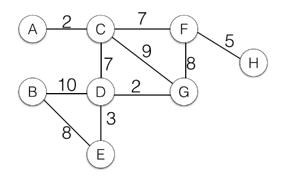
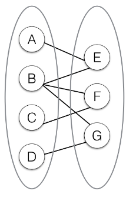
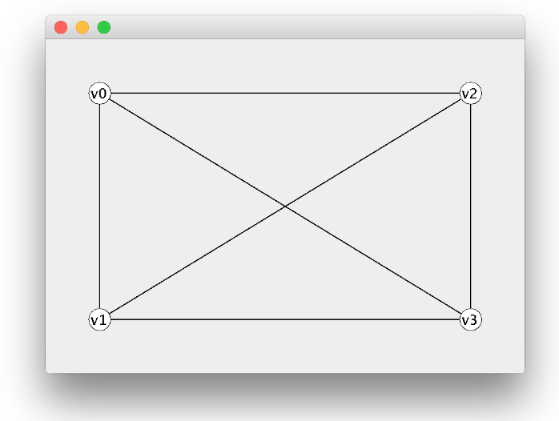
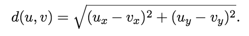

# Homework 6

COMS W3134 - Data Structures in Java
* 100pts total 
* Due: December 5th, 11:59pm

Please be aware of the [late homework and academic honesty policy on the course website](http://www.cs.columbia.edu/~bauer/cs3134/homework.html).

Make sure to check that you submitted all your files to Github. In general, late submissions will not be accepted.

#Part 1 - Theory (30 pts)

## Problem 1 (10 pts)
Use  Kruskal's  algorithm  to  find  the  minimum  spanning  tree  on  the  following graph.

Show  the forest maintained after each step.

# Problem 2 (10 pts)
Provide an example directed graph *G* in which Dijkstra's algorithm will produce the wrong result
because *G* contains a negative weight edge (but no negative cost cycle).  Show a run of Dijkstra's
algorithm  that  provides  the  wrong  result  (i.e.   doesn't  find  the  correct  shortest  path  cost  for  a
node).

# Problem 3 (10 pts)
A bipartite graph *G= (V; E)* is a graph whose vertices *V* can be partitioned into two disjoint sets *V₁* and *V₂*, such that every edge connects a vertex in *V₁* to one in *V₂*. For every edge *(u,v)* either *u ∈ V₁* and *v ∈ V₂*, or *u ∈ V₂* and *v ∈ V₁*. For example, the following graph is bipartite with  *V₁={A,B,C,D}* and *V₂={E,F,G}*.

Describe  an  algorithm  (in  pseudocode  or  in  your  own  words)  that  detects  if  a  graph  is
bipartite.  Your algorithm should run in *O(|V|+|E|)*.  Hint:  Try to modify breadth first search.

#Part 2 - Programming (70 pts)

In this problem you will implement several graph algorithms and run them on a graph representing train connections between North American cities. You will also visualize the graph and the result of the algorithms using Java's Swing GUI toolkit (This has been implemented already. You won't have to do any GUI programming yourself). The result is very similar to what a route planning application (like Google maps) would do.

Before you start, compile  the  code for homework 5 and run  the class `Graph`.
This should open the following window: 

Take some time to understand how the main method of `Graph` constructs a new graph and then uses `DisplayGraph` to visualize it.

### Problem  4 (8 pts)
The class `Graph` represents directed, unweighted graphs using adjacency lists.  Instead of `Vertex` objects, the adjacency lists in `Graph` store `Edge` objects.  The `Edge` objects allow us to store additional information associated with each edge.
`Vertex` objects store information associated with each vertex, such as coordinates to display the vertex, and fields that are used by the graph algorithms for bookkeeping. 

The graph implementation already contains a method `addEdge(String s, String t, double cost)` to support weighted edges.  Add a method `public void addUndirectedEdge(String s, String t, double cost)` to `Graph` that adds  an undirected edge between  the  vertices with the names *s* and *t* (think about how to model the adjacency relation in an undirected graph using a directed graph).

### Problem 5 (13 pts)
The file `ttrvertices.txt` contains definitions for a set of cities.  There is one city per line.  Each line consists of three comma-separated fields:  the city name, the city's horizontal coordinate, and the city's vertical coordinate (the top left coordinate is 0:0, coordinates are always integers).  For instance,  the  line  `NewYork,700,165` defines  the  city NewYork at  position  700:165.
The  file `ttredges.txt` contains defnitions for train connections.  Each line contains a comma separated
pairs  of  city  names.    For  instance,  the  line `Montreal,NewYork`  defines  a  train  connection between
Montreal and NewYork. Write the class `MapReader`, which contains a static method `Graph readGraph(String vertexfile, String edgefile)` that reads in a graph in the format described above and returns a new `Graph` object.  All edges are undirected edges, so use your `addUndirectedEdge` method from the previous problem. You can set the weight of each edge to 1.0 initially.

Write a main method for `MapReader`. When the program is called using

`$ java  MapReader  ttrvertices.txt  ttredges.txt`

it should read in a map and store it as a Graph.  It should then display the map, using the same mechanism as in the main method for the `Graph` class. Make sure to only display the map in the main method, not in the `readGraph` method.

### Problem 6 (10 pts)
Write the method `public double computeEuclideanCost(double ux, double uy, double vx, double vy)` that computes the euclidean  (i.e.  straight line) distance between two coordinates (specified by (ux, uy) and (vx, vy) respectively, where the parameter ending in x is the horizontal coordinate, and the parameter ending in y is the vertical coordinate).
The euclidean distance is defined as  
Take a look at [java.lang.Math](https://docs.oracle.com/javase/8/docs/api/java/lang/Math.html) to do the calculation.

Then, write the  method `public void computeAllEuclideanCosts()` to *Graph* that  computes  and  sets the cost for **each edge** using the euclidean distance between the coordinates of the vertices.

### Problem 7 (13 pts)
Add a method `public void doBfs(String s)` to
Graph, that uses Breadth First Search (BFS) to find the unweighted shortest paths (i.e. the paths with the lowest number of edges) from the start vertex with the name `s`.  Use the `visited`, `cost` and `backpointer` fields in the Vertex class for the required  bookkeeping. Make sure the algorithm sets all three fields for each vertex. Calling the  method  should  not  actually  return  the  paths,  but  just  set  the  correct  information  for  each vertex.  Then add a method public `Graph getUnweightedShortestPath(String s, String t)`
, that first calls `doBfs` and then extracts the shortest path from the vertex with the name `s` to the vertex with the name
`t`.  The result of this method should be a `Graph` that contains the same vertices as the original graph, but only the subset of edges that is on the shortest path.

Write a testing class `TestBfs` that reads in a map file (using `MapReader`), then runs
`getUnweightedShortestPath` on the graph to compute the shortest path between two cities.  It then displays the shortest path graph returned by `getUnweightedShortestPath`.
The  two  cities  should  be  passed  to  the  program  as  additional  command  line  parameters,  for
instance:
`$ java  TestBfs  ttrvertices.txt  ttredges.txt  NewYork  LosAngeles`.

### Problem 8 (13 pts)
Add a method public void `doDijkstra(String s)` to `Graph`, that uses Dijkstra's algorithm to  find  the  weighted  shortest  paths  from  the  start  vertex  with  the  name *s*.   As  before,  calling the method should just set the correct information for each vertex (using the same three fields as for BFS). 

As for BFS, write a method `public Graph getWeightedShortestPath(String s, String t)`
that returns a `Graph` with the  same  vertices  as  the  original  graph,  but  only  the  edges  on  the  shortest  cost  path  between *s* and *t*.  

When implementing Dijkstra's algorithm, be careful what kind of object you store in the PriorityQueue. If the algorithm updates the minimum path cost for a vertex the second time, you should NOT update the cost for the previous entry in the PriorityQueue. Since the PriorityQueue is implemented as a heap, this would cause the heap order property to be violated and would ultimately lead to wrong results. Instead, you might want to create a new class that stores a pair of the cost and a reference to the vertex object. You can then insert a new instance of this class into the PriorityQueue each time you update the cost for a vertex.

Write a testing class `TestDijkstra` that reads in a map fle, runs `getWeightedShortestPath` on the graph, and then displays the resulting graph.  The program should accept the same command line arguments as `TestBfs`.

Provide an example of a city pair (add a comment to doDijkstra), for which the unweighted shortest path found by BFS is different than the weighted shortest path found by Dijkstra's algorithm.

### Problem 9 (13 pts)
Add a method public void `doPrim(String s)` to `Graph`, that uses Prim's algorithm to find a *minimum spanning tree* rooted in *s*.  As before, the method should just update information in the  vertices  of  the  graph. Make sure you set the `visited`, `cost`, and `backpointer` fields.  Write  a  method `public Graph getMinimumSpanningTree(String s)` that  calls `doPrim` and  returns  a  `Graph`  that  contains  the  same  vertices  as  the  original  graph, but only the edges in the MST found by Prim's algorithm.

Write a testing class `TestPrim` that reads in a map file, runs getMinimumSpanningTree on the graph,  and  then  displays  the  resulting  graph.  The  program  should  accept  the  map file  and  the starting city for Prim's algorithm as command line arguments, so you can run it like this:

`$ java  TestPrim  ttrvertices.txt  ttredges.txt  KansasCity`

